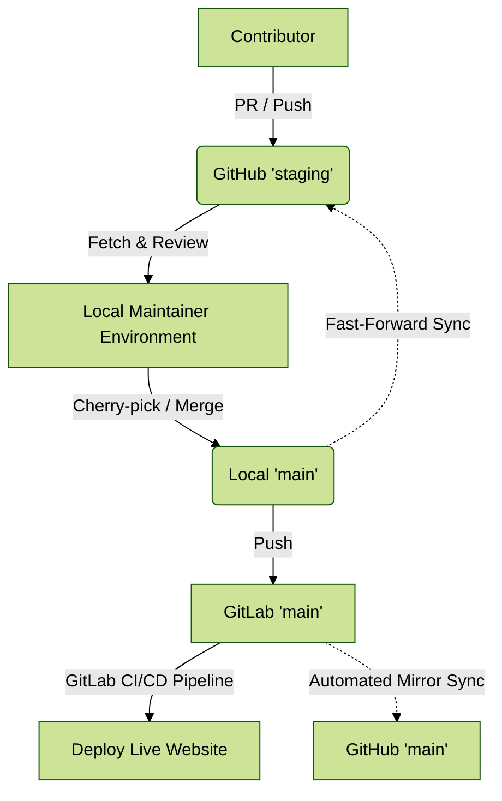

# Developers

This page explains the underlying toolset, rules, and style conventions for our Jupyter Book collaboration.

We are open to contributions in any format and will harmonize these after submission. However, if you are familiar with Jupyter, you can submit your contributions directly in the `.ipynb` / `.md` format following the conventions outlined here.

This project is a collaborative team effort. This page provides a walkthrough for developing, reviewing, and contributing to the [IOER Conference 2026 HaCLAthon](https://hack.conference.ioer.info).


*Made with ❤️, Collaboration, and Open Source Software. Picture: 2021 Alexander Dunkel*

**Table of Contents**
- [1. Overview of files](#1-overview-of-files)
- [2. Publishing & Multi-Remote Sync Process](#2-publishing--multi-remote-sync-process)
   * [2.1 The GitHub ↔ GitLab Workflow](#21-the-github--gitlab-workflow)
   * [2.2 Maintainer Runbook: Integrating External Submissions](#22-maintainer-runbook-integrating-external-submissions)
   * [2.3 Syncing the GitHub Staging Branch](#23-syncing-the-github-staging-branch)
- [3. Editing files](#3-editing-files)
- [4. Jupyter Collaborative Editing](#4-jupyter-collaborative-editing)
   * [4.1 Start with editing a Jupyter notebook](#41-start-with-editing-a-jupyter-notebook)
   * [4.2 Open the Jupyter git extension](#42-open-the-jupyter-git-extension)
   * [4.3 Commit changes](#43-commit-changes)
   * [4.4 Write a commit message](#44-write-a-commit-message)
   * [4.5 Push changes to remote](#45-push-changes-to-remote)
   * [4.6 Wait for the website to update](#46-wait-for-the-website-to-update)
- [5. Git best practices](#5-git-best-practices)
- [6. Semantic Versioning](#6-semantic-versioning)
- [7. Formatting conventions](#7-formatting-conventions)
- [8. Citations and References](#8-citations-and-references)

---

(dev:overview)=
# 1. Overview of files

All documents are edited as Jupyter notebooks (paired with Markdown via Jupytext) in the subfolder `notebooks/` and `md/`:

- `00_quickstart.md`: The general onboarding guide for participants.
- `200_community_index.md`: The live index and notice board of accepted hacks.
- `201_digital_landscape_traces.md`: Example chapter demonstrating the data story format.
- `references.bib`: Central BibTeX bibliography file.
- `_toc.yml`: Table of Contents defining the Jupyter Book chapter structure.

---

(dev:publishing)=
# 2. Publishing & Multi-Remote Sync Process

The HaCLAthon infrastructure connects **GitHub** (public community hub for issues, PRs, and Decap CMS edits) with **GitLab** (internal CI/CD build engine, semantic release, and web hosting):

- **Production Site (Public):** https://hack.conference.ioer.info (GitLab branch `main`)
- **Staging Site (Internal):** https://stag.hack.conference.ioer.info/ (GitLab branch `staging`)



---

## 2.1 The GitHub ↔ GitLab Workflow

1. **Community Submissions:** Contributors submit drafts on GitHub against the `staging` branch (either via git or the visual browser editor).
2. **Review & Audit:** Maintainers inspect incoming changes locally on a review branch, verify Jupytext syncing, check links, and ensure formatting standards.
3. **CI/CD Build:** Changes are merged into local `main` and pushed to GitLab (`origin main`). The GitLab pipeline builds the static HTML, bumps the semantic version, and updates the production server.
4. **Mirroring:** GitLab mirrors `main` back to GitHub, ensuring full transparency.

---

## 2.2 Maintainer Runbook: Integrating External Submissions
### 2.2.1 Integrating Direct GitHub Contributions

When integrating a contribution from GitHub's `staging` into `main`, preserve **author attribution** (so the contributor is recognized as the author in git history and GitHub graphs) by following these steps:

**Step 1: Fetch all remotes**
```bash
git fetch origin
git fetch github
git checkout main
git pull origin main
```

**Step 2: Inspect incoming commits**
Create a temporary inspection branch tracking GitHub's `staging`:
```bash
git checkout -b review-incoming github/staging
git log --oneline main..HEAD
```

**Step 3: Cherry-pick the contributor's commits onto a clean branch**

Rather than merging a potentially outdated `staging` branch, create a fresh branch from `main` and cherry-pick only the contributor's commits:
```bash
git checkout main
git checkout -b feature/contribution-name
git cherry-pick <COMMIT_HASH_1> <COMMIT_HASH_2>
```

```{note}
`git cherry-pick` preserves the original **Author** metadata automatically.*
```

**Step 4: Resolve conflicts & verify formatting**
* Verify `_toc.yml` and `references.bib`.
* Ensure Jupytext sync is run if `.md` was added: `jupytext --sync md/<chapter>.md`.
* Check that relative image paths point to `resources/`.

**Step 5: Merge into `main` and push to GitLab**
```bash
git checkout main
git merge --no-ff feature/contribution-name -m "feat(community): add chapter by <Author Name>"
git push origin main
```

### 2.2.2 Integrating External GitHub Pull Requests (PRs)

When a contributor submits a contribution via a GitHub Pull Request (e.g., via the Decap CMS or a fork), use this workflow to fetch the PR locally, test it, and merge it with full author attribution (preserving the purple "Merged" status on GitHub):

```bash
# 1. Fetch the PR into a local review branch (replace '4' with the PR number)
git fetch github pull/4/head:pr-4

# 2. Inspect the incoming changes
git checkout pr-4
git log -1 --stat
git diff main..HEAD

# 3. Switch to main and merge with a merge commit (preserves Author and commit graph)
git checkout main
git pull origin main
git merge --no-ff pr-4 -m "feat(community): merge PR #4 by @contributor_username"

# 4. Push to GitLab (deploys website & bumps semantic release)
git push origin main

# 5. Push to GitHub (automatically marks the PR as Merged/Purple on GitHub!)
git push github main

# 6. Fast-forward GitHub staging to the latest main
git push --force-with-lease github main:staging

# 7. Clean up local review branch
git branch -D pr-4
```

---

## 2.3 Syncing the GitHub Staging Branch

After merging to `main` and verifying the CI/CD pipeline, bring GitHub's `staging` branch up to date with `main` so subsequent contributors work from the latest baseline:

```bash
git push --force-with-lease github main:staging
```

```{note}
Because all cherry-picked/merged commits are preserved in `main`, this cleanly fast-forwards `staging` without overwriting or deleting any author history.
```

---

(dev:editing)=
# 3. Editing files

Depending on your comfort level with Git, choose one of the following paths:

1. **JupyterLab Git Extension:** Use collaborative JupyterLab instances and follow [Section 4: Jupyter Collaborative Editing](#4-jupyter-collaborative-editing).
2. **Web Browser CMS:** Edit text directly via Decap CMS (see [Guide for Writers](01_guide_writers.md)).
3. **Local Git Clone:** Clone the repository locally and edit `.ipynb` / `.md` files directly.

---

(dev:collaborative)=
# 4. Jupyter Collaborative Editing

Join a collaborative Jupyter session in your browser.

## 4.1 Start with editing a Jupyter notebook

```{figure} resources/01_edit_files.gif
:name: edit-files
Start with editing a Jupyter notebook.
```
Save changes to the notebook file with <kbd>Ctrl+S</kbd>.

## 4.2 Open the Jupyter git extension

```{figure} resources/02_git_extension.gif
:name: git-extension
Find the JupyterLab Git extension in the left sidebar.
```

## 4.3 Commit changes

```{figure} resources/03_stage_changes.gif
:name: stage-files
Stage changed files by clicking the `+` icon.
```

## 4.4 Write a commit message

```{figure} resources/04_commit_message.gif
:name: staging-changes
Write a short, descriptive commit message following Conventional Commits, then click `Commit`.
```

## 4.5 Push changes to remote

If an orange dot appears next to the pull icon, click to `pull` changes first:
```{figure} resources/05_pull_changes.gif
:name: pull-changes
Click on "Pull changes from remote".
```

```{figure} resources/06_push_changes.gif
:name: push-changes
Click on "Push changes to remote".
```

## 4.6 Wait for the website to update

Check the [GitLab CI Pipelines](https://gitlab.hrz.tu-chemnitz.de/ioer/fdz/training/hackathon-ioer-conference-2026-/pipelines) and wait 1–2 minutes until the pipeline completes.

```{figure} resources/07_ci_pipeline.webp
:name: pipeline-passed
A passed pipeline with green checkmarks.
```

---

(dev:bestpractices)=
# 5. Git best practices

- **Commit often:** Commit and push after every distinct change to back up your work.
- **Pull before you start:** Always pull the latest changes from remote before editing.
- **Temporary workspaces:** Store intermediate experiments under `tmp/`. Files in `tmp/` are ignored by Git.

---

(dev:semver)=
# 6. Semantic Versioning

The book is automatically versioned using [python-semantic-release](https://python-semantic-release.readthedocs.io/en/latest/) adhering to [Semantic Versioning](https://semver.org/) (`MAJOR.MINOR.PATCH`). 

Please write commit messages following the [Conventional Commits Specification](https://www.conventionalcommits.org/en/v1.0.0/):

| Commit Type | Purpose | Release Effect |
| :--- | :--- | :--- |
| `docs:` | Descriptions, chapter text, fixing typos | Listed under *Documentation* |
| `fix:` | Minor code bug fixes | Triggers **PATCH** bump (`0.1.X`) |
| `feat:` | New chapters, major code features | Triggers **MINOR** bump (`0.X.0`) |
| `ci:` | Pipeline and build config changes | Listed under *Continuous Integration* |
| `refactor:`, `style:` | Code restructuring without feature changes | No version bump |

---

(dev:formatting)=
(content:references:formattingconventions)=
# 7. Formatting conventions

- **Concise sentences:** Aim for 10–15 words per sentence.
- **Figures:** Use `.webp` for raster graphics and `.svg` for diagrams.
- **Language:** Use American English throughout the documentation.

## Figure and Table formatting

````markdown
```{figure} ../resources/data-processing.webp
:name: data-processing
:figclass: fig-no-shadow

Data Processing Workflow.
```
````

See the [Jupyter Book docs](https://jupyterbook.org/en/stable/content/references.html#reference-section-labels) on how to create Figures and Tables with caption.

There is a `box-shadow` effect shown around figures by default. If you want to disable this on selected graphics, add `:figclass: fig-no-shadow` to the `{figure}`-tag.

```````{admonition} Like so
:class: dropdown, hint
``````
```{figure} ../resources/data-processing.png
:name: gbif-graphic
:figclass: fig-no-shadow

GBIF Data Processing Documentation 
```
``````
```````

## Cross-references

Always define explicit anchors to avoid breaking internal links when headings change:

```markdown
(content:myanchor)=
## My Section Title

Link back using: [My Section Title](content:myanchor)
```

See [the docs](https://jupyterbook.org/en/stable/content/references.html#reference-section-labels)

## Admonitions (Callouts)

Use MyST admonitions to structure information:

````markdown
```{admonition} Important Note
:class: note
This is a standard callout.
```
````

```{admonition} Important Note
:class: note
This is a standard callout.
```

````markdown
```{admonition} Try it yourself!
:class: dropdown, attention
This creates a collapsible orange action box.
```
````

```{admonition} Try it yourself!
:class: dropdown, attention
This creates a collapsible orange action box.
```

---

(dev:citations)=
# 8. Citations and References

Citations are managed using [sphinxcontrib-bibtex](https://github.com/mcmtroffaes/sphinxcontrib-bibtex).

1. **Add BibTeX entry:** Add the citation to `references.bib` in the root folder.
2. **Use in text:**
   - Parenthetical: `{cite:p}` $\rightarrow$ `(Dunkel et al., 2025)`
   - Inline text: `{cite:t}` $\rightarrow$ `Dunkel et al. (2025)`
   - Author-only: `{cite:alp}` $\rightarrow$ `Dunkel et al. 2025`
3. **Chapter bibliography:** Add the following block to the end of your notebook:

````markdown
## References

```{bibliography}
:style: unsrt
:filter: docname in docnames
```
````